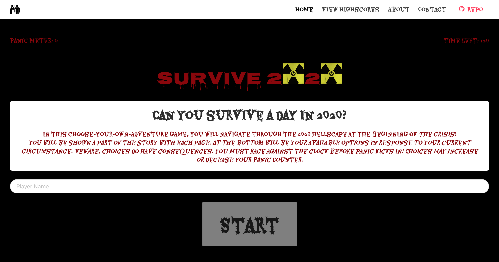
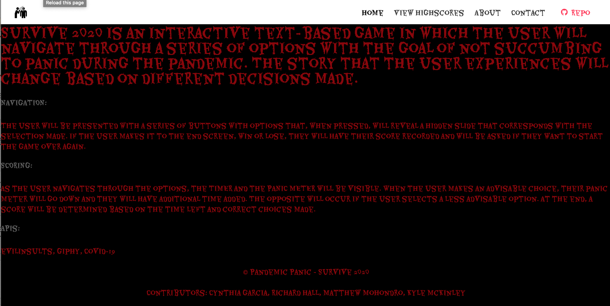
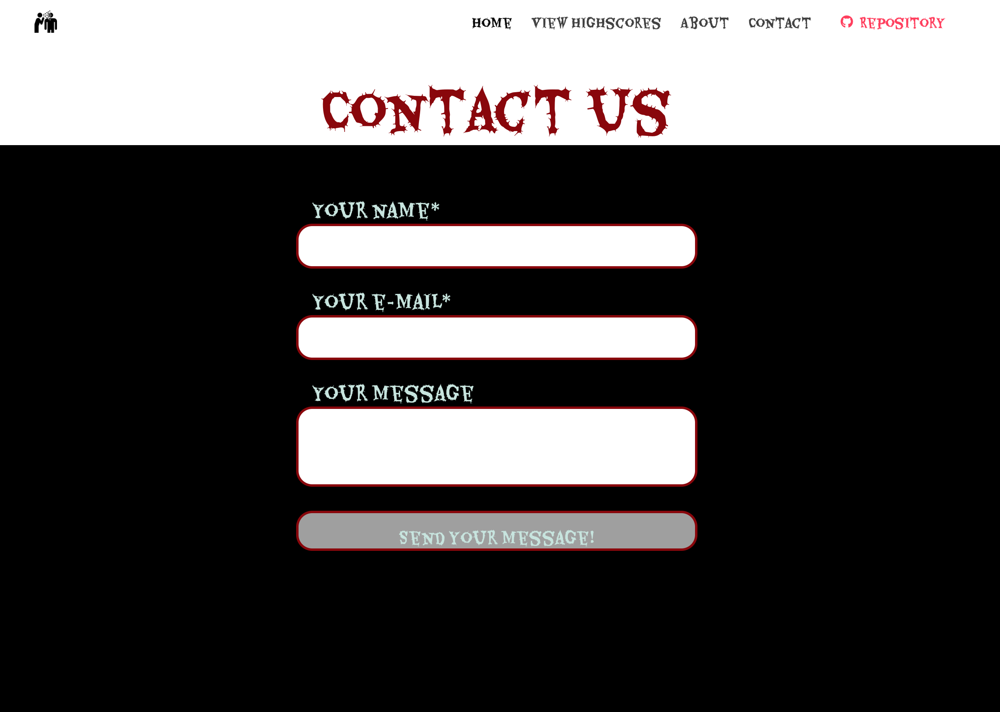
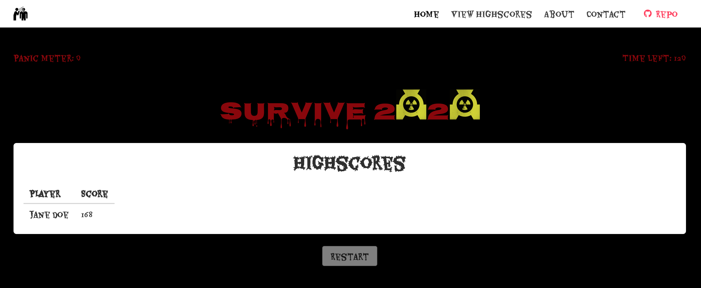

# Survive 2020

# Description 
---------------
Survive 2020 is an interactive text-based game in which the user will navigate through a series of options with the goal of not succumbing to panic during the pandemic. The story that the user experiences will change based on different decisions made. 

# Tools
----------
- HTML5
- CSS3
- JavaScript
- jQuery
- Bulma.io
- Evil Insults API
- Giphy API
- Covid-19 API

# Access 
---------------
Access live game: [Survive 2020](https://mattmoe1.github.io/Survive-2020/)

# Functionality 
-----------------
- NAVIGATION: The user will be presented with a series of buttons with options that, when pressed, will  reveal a hidden slide that corresponds with the selection made. if the user makes it to the end screen, win or lose, they will have their score recorded and will be asked if they want to start the game over again.

- SCORING: As the user navigates through the options, the TIMER and the PANIC METER will be visible. When the user makes an advisable choice, their panic meter will go down and they will have additional time added. The opposite will occur if the user selects a less advisable option. At the end, a score will be determined based on the time left and correct choices made.

- ABOUT: the user will have access to the ABOUT screen which will contain the basic intro and explanation for the game.

# View
---------------

# Contributors: 

- Cynthia Garcia 
- Richard Hall 
- Matthew Mohondro 
- Kyle McKinley
